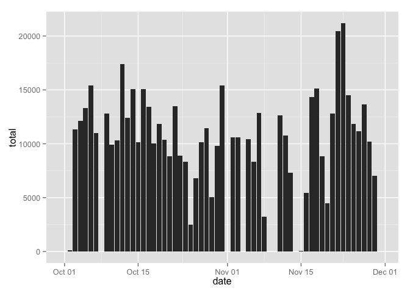

# Reproducible Research: Peer Assessment 1
This assignment makes use of data from a personal activity monitoring
device. This device collects data at 5 minute intervals through out the
day. The data consists of two months of data from an anonymous
individual collected during the months of October and November, 2012
and include the number of steps taken in 5 minute intervals each day.


```r
library(plyr)
library(ggplot2)
library(lattice)
```

## Loading and preprocessing the data
The data used for this analysis is included in the Git repository with this report. The original raw data is
available in the activity.zip file located in the root level of the repository. The original file is available on the course web site here: [Activity monitoring data](https://d396qusza40orc.cloudfront.net/repdata%2Fdata%2Factivity.zip).


```r
unzip("activity.zip")
data <- read.csv("activity.csv")
data$date <- as.Date(data$date)
```

## What is mean total number of steps taken per day?
Ignoring missing values, show the total number of steps taken per day  

```r
data_summary <- ddply(data, c("date"), summarize,
                      total = sum(steps,na.rm = TRUE),
                      mean = mean(steps, na.rm = TRUE),
                      median = median(steps, na.rm = TRUE))

ggplot(data=data_summary,aes(x=date,y=total)) + geom_bar(stat="identity")
```

 

Calculate the mean and median number of steps taken

```r
daily_mean <- mean(data_summary$total,na.rm=TRUE)
daily_median <- median(data_summary$total,na.rm=TRUE)
```
Mean: 9354.2295082  
Median: 10395

## What is the average daily activity pattern?

Plot a chart of the 5-minute interval (x-axis) and the average number of steps taken, averaged across all days (y-axis)

```r
avg_summary <- ddply(data, c("interval"), summarize, mn = mean(steps, na.rm=TRUE))
ggplot(data=avg_summary, aes(x=interval,y=mn)) + geom_line()
```

 

```r
max_interval <- avg_summary[max(avg_summary$mn) == avg_summary$mn,"interval"]
```

The highest average time interval is 835


## Imputing missing values

Need to identify the total number of rows in the dataset with missing values

```r
missing_val_count <- nrow(data[is.na(data$steps),])
```
There are 2304 rows with missing values

For this data set we will fill in those missing values to help smooth out the data for analysis. For this analysis we will replace the missing value with the mean step count for the same interval.


```r
impute.mean <- function(x) replace(x, is.na(x), mean(x, na.rm=TRUE))
imputed_data <- ddply(data, .(interval), transform, steps = impute.mean(steps))
```

Display a histogram of the imputed data

```r
imputed_data_summary <- ddply(imputed_data, c("date"), summarize,
                      total = sum(steps,na.rm = TRUE),
                      mean = mean(steps, na.rm = TRUE),
                      median = median(steps, na.rm = TRUE))

ggplot(data=imputed_data_summary,aes(x=date,y=total)) + geom_bar(stat="identity")
```

 

Calculate the mean and median number of steps taken using the imputed data

```r
imputed_daily_mean <- mean(imputed_data_summary$total,na.rm=TRUE)
imputed_daily_median <- median(imputed_data_summary$total,na.rm=TRUE)
```
Imputed Mean: $1.0766189\times 10^{4}$  
Imputed Median: $1.0766189\times 10^{4}$

After imputing the missing values the mean and median are equal, but differ  from the original mean and median (9354.2295082 and 10395 respectively). The values are fairly close to the original median.


## Are there differences in activity patterns between weekdays and weekends?
Add additional factor to imputed data to indicate whether the date for the record is a weekend or weekday.

```r
imputed_data$daytype <- as.factor(ifelse(weekdays(imputed_data$date,abbreviate=TRUE) %in% c("Sat","Sun"), "weekend", "weekday"))
```

Plot the mean number of steps by interval for weekdays and weekends

```r
daytypesummary <- ddply(imputed_data, .(interval, daytype), summarize, steps = mean(steps))
xyplot(steps ~ interval | daytype, data = daytypesummary, type = "l", xlab = "Interval", ylab = "Number of Steps", layout=c(1,2))
```

 
